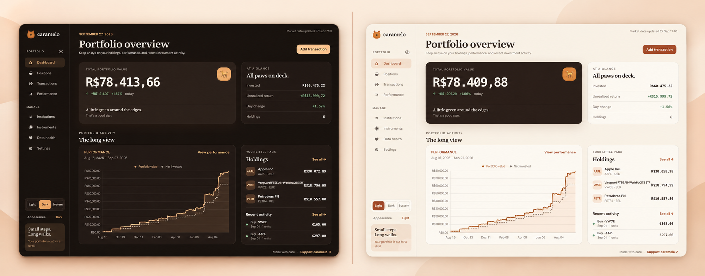

<p align="center">
  
</p>

<h1 align="center">caramelo</h1>

<p align="center">
  Your investments, without sending your portfolio somewhere else.
</p>

<p align="center">
  <a href="https://github.com/HenriqueMorato/caramelo/actions/workflows/ci.yml?query=branch%3Amain"></a>
  <a href="https://coveralls.io/github/HenriqueMorato/caramelo?branch=main"></a>
  <a href="#quick-start"></a>
  <a href="https://ko-fi.com/henriquemorato"></a>
</p>

<p align="center">
  A local-first portfolio tracker for one owner. Record trades, follow
  positions, compare currencies, and explore historical performance while
  keeping the primary ledger on your own machine.
</p>

<p align="center">
  
</p>

## What You Can Do

- Keep a precise buy-and-sell ledger with fees, institutions, notes, and paid FX.
- Follow open and closed positions with weighted-average cost basis.
- Track current prices for supported Brazilian, US, and European listings.
- Review portfolio and per-instrument performance from persisted daily history.
- Compare portfolio returns with Ibovespa, S&P 500, CDI, and a global all-cap
  MSCI ACWI IMI net total-return benchmark.
- Review provider-sourced dividends and corporate actions before confirmation.
- See missing or stale market data and safely retry replaceable projections.
- Create verified local backups and export the trade ledger as CSV.
- Switch between light, dark, and system appearance.

## Quick Start

The Docker setup is the easiest way to try caramelo.

You need [Docker Desktop](https://www.docker.com/products/docker-desktop/),
[OrbStack](https://orbstack.dev/), or another Docker-compatible runtime with
Docker Compose.

From the repository root, run:

```sh
docker compose up --build
```

Then open <http://localhost:3000>.

That one command:

1. builds the production image;
2. creates persistent volumes for application data and verified backups;
3. generates a private application secret on the first run;
4. prepares the SQLite databases and seeds the default owner;
5. starts the web application and the Solid Queue worker.

The first build can take a few minutes. When `web` is healthy and `jobs` is
running, caramelo is ready. No environment file is required for the default
local setup.

Press `Ctrl-C` to stop the foreground stack. Your records remain in Docker
volumes, so the next start is simply:

```sh
docker compose up
```

### Useful Docker Commands

| Task | Command |
| --- | --- |
| Start in the background | `docker compose up --build --detach` |
| Check web and worker status | `docker compose ps` |
| Follow application and queue logs | `docker compose logs --follow web jobs` |
| Check application health | `curl --fail http://localhost:3000/up` |
| Stop caramelo | `docker compose down` |
| Open a Rails console | `docker compose exec web bin/rails console` |

`docker compose down` removes containers and the private network, but keeps
the named volumes. Do not add `--volumes` unless you intentionally want to
delete the local application data and backups.

### Optional Configuration

The built-in owner identifier is `admin@caramelo.local`. To choose another
address for a fresh install, copy the example before the first run:

```sh
cp .env.docker.example .env.docker
```

Edit `CARAMELO_OWNER_EMAIL` in `.env.docker`, then start the stack. Existing
installations keep resolving the previous owner automatically, and legacy
environment variables remain supported during the rename. The ignored
environment file may also hold a manually managed `SECRET_KEY_BASE`, but
caramelo normally creates and retains one inside its private storage volume.

To use another host port without editing a file:

```sh
CARAMELO_PORT=8080 docker compose up --build
```

The default bind address is `127.0.0.1`, so the unauthenticated application is
reachable only from the Docker host. To allow another trusted device on your
network to connect, opt in explicitly:

```sh
CARAMELO_BIND_ADDRESS=0.0.0.0 docker compose up --build
```

caramelo is currently a single-user app and login is not active. Keep the
default localhost binding unless you trust every device on the network. Do not
expose the `0.0.0.0` binding to an untrusted network.

## First Run

Once the dashboard opens, set up one position from the menus:

1. Open **Instruments** and choose **Add instrument**. Enter the listing's
   ticker, exchange MIC (the market's short code, such as `BVMF` for B3 or
   `XNAS` for Nasdaq), currency, and asset type.
2. If you want to record a broker or custodian, open **Institutions** and add
   it. Institutions are optional.
3. Choose **Add transaction** on the dashboard, or open **Transactions** and
   choose **Add → Trade**. Select the instrument, enter the side, date,
   quantity, price, and any fees, then save.
4. Open **Data health** and choose **Refresh prices**. The `jobs` container
   handles this work in the background; the trade remains saved while a quote
   is pending or unavailable.
5. Open **Positions** to check the holding. **Performance** becomes available
   as daily closing prices and historical FX are prepared. Weekends and market
   holidays may leave an expected gap; current quotes are never used as
   historical prices.

You can change the reporting currency in **Settings**. The default is BRL, and
the required historical FX is prepared in the background. If you receive a
dividend or another market event, open **Transactions → Review imports** when a
review banner appears. Imported events stay out of the ledger until you review
and confirm them.

## When Data Is Missing

The **Data health** page tells you whether a price, exchange rate, benchmark,
or performance series is missing, stale, queued, or failed. Use its retry or
refresh actions before changing a trade. A missing market observation does not
delete your trades or positions.

If the page does not update, check that both containers are running:

```sh
docker compose ps
docker compose logs --follow web jobs
```

The `web` service serves the pages and the `jobs` service processes prices,
historical data, income scans, backups, and performance rebuilds. Keep both
running while the application is preparing data.

## Your Data Stays Local

The Compose stack uses two named volumes:

- `caramelo_storage` contains the SQLite application, cache, queue, and cable
  databases, plus the generated application secret.
- `caramelo_backups` contains verified backup runs.

The browser does not upload your ledger to a caramelo service. Refreshing
supported prices, exchange rates, or benchmarks makes outbound requests to the
documented market-data providers. Current quotes and historical observations
are replaceable data; trades remain the durable source of truth.

### Back Up and Export

Create and verify a backup from the running stack:

```sh
docker compose exec web bin/backup create
BACKUP_DIRECTORY=2026-09-10T120000.000000Z
docker compose exec web bin/backup verify "/rails/backups/$BACKUP_DIRECTORY"
```

Replace the example directory name with the `Directory:` value printed by the
create command.

Copy the backup directory to protected off-host storage as part of your own
backup routine:

```sh
docker compose cp web:/rails/backups ./caramelo-backups
```

Backup artifacts contain private financial information. The Data health page
also lets you create or verify a backup and download the trade ledger as CSV.
See [development and operations](DEVELOPMENT.md#sqlite-backups) for retention,
restore rehearsal, and safe pruning details.

## How the Portfolio Works

Trades are authoritative. Positions are derived from those trades using exact
decimal quantities and weighted-average cost basis. Buy fees increase cost;
sell fees reduce realized proceeds. Native-currency values remain native, while
reporting views use the appropriate paid, trade-date, or valuation-date FX rate.

Performance is materialized asynchronously from trades, daily closing prices,
and historical FX. Missing historical data stays visibly unavailable. Current
quotes never masquerade as historical closes. Portfolio and instrument return
series are calculated independently because their cash flows have different
capital weights.

Read more:

- [Portfolio performance](docs/portfolio-performance.md)
- [Instrument performance](docs/instrument-performance-observations.md)
- [Current market prices](docs/current-market-prices.md)
- [Current valuation and currencies](docs/current-valuations.md)
- [Historical exchange rates](docs/historical-exchange-rates.md)
- [Global all-cap benchmark](docs/global-benchmark.md)
- [Corporate actions and income](docs/corporate-actions.md)
- [Corporate-action ingestion](docs/corporate-action-ingestion.md)
- [Data health and recovery](docs/market-data-health.md)

## Support caramelo

caramelo is independent and local-first. If it helps you keep your portfolio in
order, you can [support its development on Ko-fi](https://ko-fi.com/henriquemorato).

## Develop caramelo

For a native setup:

```sh
bin/setup --skip-server
bin/rails db:seed
bin/dev
```

Open <http://localhost:3000>. Run the full local verification pipeline with:

```sh
bin/ci
```

Ruby, Node, SQLite, browser-test, Dev Container, and focused-test instructions
are in [DEVELOPMENT.md](DEVELOPMENT.md).

## License

caramelo is free software under the GNU Affero General Public License v3.0.
You can use, modify, and redistribute it, including commercially, as long as
you preserve the license and provide the corresponding source for modified
versions. Modified hosted versions must also offer that source to users over
the network. See the [license](LICENSE) for the full terms.
