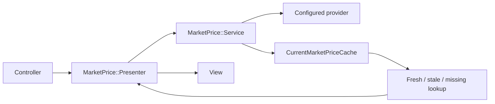
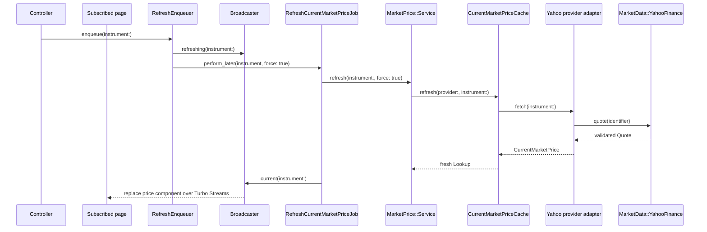

# Current Market Price Architecture

Current market prices are replaceable reference data. Trades remain the durable
source of portfolio truth, and no trade or position calculation depends on a
quote being available. Application code uses the provider-neutral
`MarketPrice` namespace; Yahoo-specific HTTP behavior stays isolated under
`MarketData::YahooFinance`.

## What Application Code Calls

Use the narrowest entry point for the task:

| Task | Entry point | Result |
| --- | --- | --- |
| Prepare a price for a view | `MarketPrice::Presenter.for(instrument:)` | A presenter for fresh, stale, missing, or unsupported data |
| Prepare a position and its price | `Position::Presenter.for(position_result:)` | One position presenter containing its market-price presenter |
| Start a user-requested refresh | `MarketPrice::RefreshEnqueuer#enqueue(instrument:)` | A queued job, or `nil` for an unsupported instrument |
| Read cached state in application logic | `MarketPrice::Service.default.read(instrument:)` | A cache lookup, or `nil` for an unsupported instrument |
| Refresh inside a job or service | `MarketPrice::Service.default.refresh(instrument:, force:)` | A fresh cache lookup |

Controllers and views must not instantiate a provider, cache, Yahoo client, or
transport. They also do not need to ask whether an instrument is supported
before calling a presenter or refresh enqueuer; those objects own that decision.

## Class Responsibilities

- `MarketPrice::Presenter` gives every view a renderable state while keeping
  cache details private. Unsupported
  instruments become unavailable presenters; supported instruments retain
  fresh, stale, or missing cache state.
- `Position::CalculationResult` holds either a calculated position or the error
  that prevented calculation for one instrument.
- `Position::Presenter` composes a position calculation result with its
  `MarketPrice::Presenter`. A positions page reuses one market-price service
  while building the collection.
- `MarketPrice::RefreshEnqueuer` validates support, broadcasts a refreshing
  state, and enqueues `RefreshCurrentMarketPriceJob`. If enqueueing fails, it
  restores the current display before re-raising the error.
- `MarketPrice::Service` selects the default provider strategy and coordinates
  provider support, cache reads, and cache refreshes.
- `MarketPrice::Providers::YahooFinance` adapts an `Instrument` to the isolated
  Yahoo client, verifies that the returned currency matches the instrument,
  and converts provider errors into application-level errors.
- `CurrentMarketPriceCache` returns one lookup per provider and instrument. It
  decides whether a quote is fresh, stale, or missing and prevents a normal
  refresh from replacing a still-fresh quote.
- `CurrentMarketPrice` is an immutable quote value. It validates precise
  decimal price, ISO currency, provider, and timestamps, and serializes decimal
  values as strings so cache round-trips never introduce floats.
- `MarketPrice::Broadcaster` rebuilds the presenter and replaces the instrument
  price component over Turbo Streams.
- `RefreshCurrentMarketPriceJob` performs one refresh and always broadcasts the
  final state. Solid Queue limits concurrent work for the same instrument.
- `RefreshTradedMarketPricesJob` periodically queues supported instruments that
  have owner trades, including closed positions.

## Read Flow

`MarketPrice::Presenter.for` asks the service to read. The service first checks
the configured provider's support. Unsupported instruments return `nil`, which
the presenter converts into a non-refreshable unavailable state. Supported
instruments receive a cache lookup even when no quote exists, so the same partial
can render every state without controller or view conditionals.

## Refresh Flow

The global refresh action enqueues all instruments traded by `User.owner`; the
nested instrument action enqueues one instrument. The recurring job runs every
30 minutes. Scheduled refreshes use normal cache freshness checks, while a user
action uses `force: true` because it explicitly requests a new quote.

## Cache and Display States

- **Fresh:** fetched less than 30 minutes ago. Normal scheduled work reuses it.
- **Stale:** older than 30 minutes. It remains visible until a newer quote
  replaces it.
- **Missing:** the provider supports the instrument, but no valid cached quote
  exists yet.
- **Unsupported:** the configured provider cannot quote the listing. The
  presenter renders an unavailable, non-refreshable state.

Cache records have no application expiry. Corrupt or currency-mismatched
payloads are discarded safely because quotes can be fetched again. A provider
failure does not delete a previously cached stale quote.

## Yahoo Finance Boundary

`MarketData::YahooFinance::Identifier` maps a supported listing to a provider
symbol. `Client` builds the fixed chart request, classifies HTTP responses, and
parses a validated `Quote`. `CurlTransport` is the only process/network layer:
it executes `curl_chrome146` without a shell, accepts only the configured Yahoo
HTTPS host, and returns a small `Response` value.

No code outside the provider adapter should depend on these classes. This keeps
the application usable if Yahoo is replaced and makes the low-level client
independently extractable.

## Adding or Replacing a Provider

1. Implement an adapter with `identifier`, `supports?(instrument:)`, and
   `fetch(instrument:)`.
2. Return a `CurrentMarketPrice` whose currency matches the instrument.
3. Translate provider-specific failures into `MarketPrice` errors.
4. Change `MarketPrice::Service::DEFAULT_PROVIDER`; callers remain unchanged.
5. Add adapter, service, cache, job, presenter, controller, and system coverage
   for any newly supported listing behavior.

Tests inject fake transports, providers, caches, and job classes at their
existing constructor seams. Automated tests must never call a live market-data
endpoint. See [DEVELOPMENT.md](../DEVELOPMENT.md) for runtime setup and focused
test commands.
