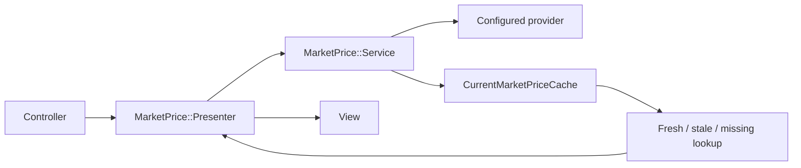
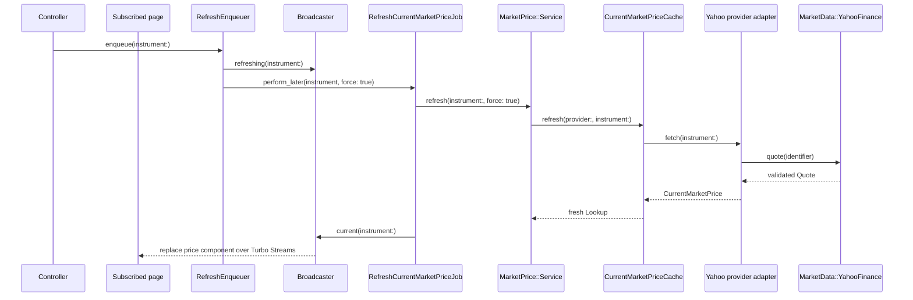
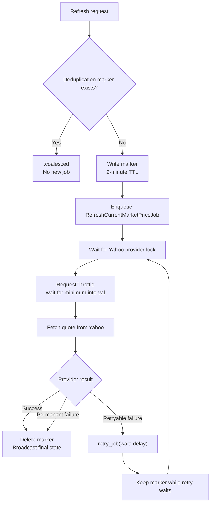

# Current Market Price Architecture

Current market prices are replaceable reference data. Trades remain the durable
source of portfolio truth, and no trade or position calculation depends on a
quote being available. Application code uses the provider-neutral
`MarketPrice` namespace; Yahoo-specific HTTP behavior stays isolated under
`MarketData::YahooFinance`.

## What Application Code Calls

Use the narrowest entry point for the task:

| Task | Entry point | Result |
| --- | --- | --- |
| Prepare a price for a view | `MarketPrice::Presenter.for(instrument:)` | A presenter for fresh, stale, missing, or unsupported data |
| Prepare a position and its price | `Position::Presenter.for(position_result:)` | One position presenter containing its market-price presenter |
| Start a user-requested refresh | `MarketPrice::RefreshEnqueuer#enqueue(instrument:)` | A queued job, or `nil` for an unsupported instrument |
| Read cached state in application logic | `MarketPrice::Service.default.read(instrument:)` | A cache lookup, or `nil` for an unsupported instrument |
| Refresh inside a job or service | `MarketPrice::Service.default.refresh(instrument:, force:)` | A fresh cache lookup |

Controllers and views must not instantiate a provider, cache, Yahoo client, or
transport. They also do not need to ask whether an instrument is supported
before calling a presenter or refresh enqueuer; those objects own that decision.

## Class Responsibilities

- `MarketPrice::Presenter` gives every view a renderable state while keeping
  cache details private. Unsupported instruments become unavailable presenters;
  supported instruments retain
  fresh, stale, or missing cache state.
- `Position::CalculationResult` holds either a calculated position or the error
  that prevented calculation for one instrument.
- `Position::Presenter` composes a position calculation result with its
  `MarketPrice::Presenter`. A positions page reuses one market-price service
  while building the collection.
- `MarketPrice::RefreshEnqueuer` validates support, broadcasts a refreshing
  state, and enqueues `RefreshCurrentMarketPriceJob`. If enqueueing fails, it
  restores the current display before re-raising the error.
- `MarketPrice::Service` selects the default provider strategy and coordinates
  provider support, cache reads, and cache refreshes.
- `MarketPrice::Providers::YahooFinance` adapts an `Instrument` to the isolated
  Yahoo client, verifies that the returned currency matches the instrument,
  and converts provider errors into application-level errors.
- `CurrentMarketPriceCache` returns one lookup per provider and instrument. It
  decides whether a quote is fresh, stale, or missing and prevents a normal
  refresh from replacing a still-fresh quote.
- `CurrentMarketPrice` is an immutable quote value. It validates precise
  decimal price, ISO currency, provider, and timestamps, and serializes decimal
  values as strings so cache round-trips never introduce floats.
- `MarketPrice::Broadcaster` rebuilds the presenter and replaces the instrument
  price component over Turbo Streams.
- `RefreshCurrentMarketPriceJob` performs one refresh and always broadcasts the
  final state. Solid Queue limits concurrent work for the same instrument.
- `RefreshTradedMarketPricesJob` periodically queues supported instruments that
  have owner trades, including closed positions.

## Read Flow

`MarketPrice::Presenter.for` asks the service to read. The service first checks
the configured provider's support. Unsupported instruments return `nil`, which
the presenter converts into a non-refreshable unavailable state. Supported
instruments receive a cache lookup even when no quote exists, so the same partial
can render every state without controller or view conditionals.

## Refresh Flow

The global refresh action enqueues all instruments traded by `User.owner`; the
nested instrument action enqueues one instrument. The recurring job runs every
30 minutes. Scheduled refreshes use normal cache freshness checks, while a user
action uses `force: true` because it explicitly requests a new quote.

### Refresh coordination, throttling, and retries

`RefreshCurrentMarketPriceJob.enqueue_for` writes an instrument-specific cache
marker with a two-minute TTL before enqueueing. A second request for the same
instrument sees that marker and returns `:coalesced`, so bulk refreshes and
repeated user actions do not create duplicate jobs. If enqueueing fails, the
marker is removed immediately.

The job also uses a Solid Queue concurrency limit for the Yahoo provider as a
whole. Only one Yahoo refresh is allowed to run at a time, regardless of which
instrument it is refreshing. `MarketPrice::RequestThrottle` adds a minimum
one-second interval between provider requests and can be made more conservative
with `YAHOO_FINANCE_MINIMUM_INTERVAL_SECONDS`.

Rate-limited and temporarily unavailable provider failures are retried up to
three executions. The job honors a numeric or HTTP-date `Retry-After` value,
caps the delay at five minutes, and adds bounded jitter so multiple workers do
not retry simultaneously. Other provider failures are reported without retry.

When a retry is scheduled, the deduplication marker remains in place while the
next execution waits in Solid Queue. Removing it at that point would allow a
new request to enqueue duplicate work alongside the already-scheduled retry.
The marker is deleted after success or a final failure; its TTL is a safety net
if a job disappears. Every attempt broadcasts the final quote state, and the
`market_price.refresh` notification exposes enqueue, coalesced, throttled,
attempted, retried, succeeded, failed, and skipped events for monitoring.

## Cache and Display States

- **Fresh:** fetched less than 30 minutes ago. Normal scheduled work reuses it.
- **Stale:** older than 30 minutes. It remains visible until a newer quote
  replaces it.
- **Missing:** the provider supports the instrument, but no valid cached quote
  exists yet.
- **Unsupported:** the configured provider cannot quote the listing. The
  presenter renders an unavailable, non-refreshable state.

Cache records have no application expiry. Corrupt or currency-mismatched
payloads are discarded safely because quotes can be fetched again. A provider
failure does not delete a previously cached stale quote.

## Yahoo Finance Boundary

`MarketData::YahooFinance::Identifier` maps a supported listing to a provider
symbol. It always receives both ticker and exchange MIC; application code never
identifies a listing by ticker alone.

| Listing MIC | Yahoo symbol | Accepted Yahoo venue metadata |
| --- | --- | --- |
| `BVMF` | ticker plus `.SA` | `SAO` |
| `XNAS` | bare ticker | `NMS`, `NGM`, or `NCM` |
| `XNYS` | bare ticker | `NYQ` |
| `ARCX` | bare ticker | `PCX` |
| `XLON` | ticker plus `.L` | `LSE` |
| `XETR` | ticker plus `.DE` | `GER` |
| `XAMS` | ticker plus `.AS` | `AMS` |
| `XPAR` | ticker plus `.PA` | `PAR` |

US symbols do not include a venue suffix, so `Client` rejects a response unless
its venue metadata matches the requested MIC. B3 and US listings accept equity
or ETF responses; the initial European venues accept only ETF responses. This
prevents a same-symbol or wrong-instrument response from silently being treated
as the requested listing. Other European venues, including Euronext Brussels,
Borsa Italiana, and SIX Swiss Exchange, remain unsupported until their listing
and provider mappings are added deliberately.

Yahoo's `ETF` metadata does not certify that a fund follows UCITS rules.
LocalFolio therefore relies on the user-maintained instrument catalog to select
a UCITS listing and validates only the provider's venue and ETF classification.
Fund discovery and regulatory classification remain outside this integration.

Yahoo reports some London prices in `GBp` (and may use `GBX`), meaning pence
rather than pounds. `Client` preserves that raw provider denomination on
`Quote`, divides the amount by 100, and exposes ISO `GBP` to the application.
A true `GBP` quote is not divided. Cache values therefore always contain an ISO
currency and a price expressed in that currency's major unit.

### ISIN and listing identity

[ISO 6166](https://www.iso.org/standard/78502.html) identifies the financial
instrument, while LocalFolio must identify the particular exchange listing.
Vanguard's official
[FTSE All-World UCITS ETF factsheet](https://fund-docs.vanguard.com/FTSE_All-World_UCITS_ETF_USD_Accumulating_9679_EU_INT_EN.pdf)
shows why these are different: ISIN `IE00BK5BQT80` has separate `VWRA` USD and
`VWRP` GBP London listings and a `VWCE` EUR Xetra listing. ISIN may later be
stored as supplemental fund metadata, but it must not replace the ticker and
MIC listing key or be unique across LocalFolio's instrument records. Each
listing retains its own quote currency.

`Client` builds the fixed chart request, classifies HTTP responses, and parses a
validated `Quote`. `CurlTransport` is the only process/network layer: it
executes `curl_chrome146` without a shell, accepts only the configured Yahoo
HTTPS host, and returns a small `Response` value.

Yahoo may provide real-time or delayed data depending on the listing, exchange,
and provider policy; LocalFolio does not promise a real-time feed. The displayed
quote time is Yahoo's `regularMarketTime`. Fresh and stale cache states describe
when LocalFolio last fetched the quote, not whether its market is open. During a
closed session, a successful refresh can retain the last published market price
and quote time. No API credential is required; the optional
`YAHOO_FINANCE_HTTP_EXECUTABLE` setting only selects the local transport binary.

No code outside the provider adapter should depend on these classes. This keeps
the application usable if Yahoo is replaced and makes the low-level client
independently extractable.

## Adding or Replacing a Provider

1. Implement an adapter with `identifier`, `supports?(instrument:)`, and
   `fetch(instrument:)`.
2. Return a `CurrentMarketPrice` whose currency matches the instrument.
3. Translate provider-specific failures into `MarketPrice` errors.
4. Change `MarketPrice::Service::DEFAULT_PROVIDER`; callers remain unchanged.
5. Add adapter, service, cache, job, presenter, controller, and system coverage
   for any newly supported listing behavior.

Tests inject fake transports, providers, caches, and job classes at their
existing constructor seams. Automated tests must never call a live market-data
endpoint. See [DEVELOPMENT.md](../DEVELOPMENT.md) for runtime setup and focused
test commands.
