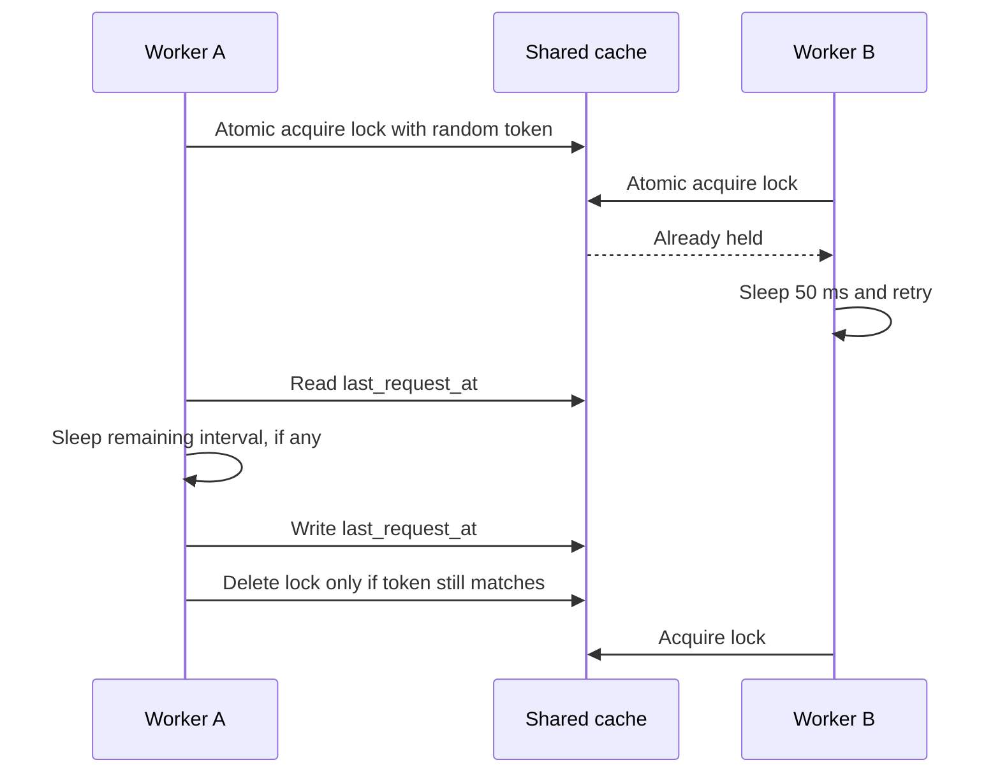

# Market-Data Request Throttling

Market-data providers can impose rate limits across every endpoint, not just
one instrument or job type. caramelo coordinates Yahoo Finance requests from
current quotes, daily closing prices, and historical FX through two layers.

## Job Concurrency and Provider Requests

Solid Queue limits execution of Yahoo refresh jobs. This prevents a burst of
jobs from actively running together, but it does not make the request interval
atomic across workers. `MarketData::RequestThrottle` provides that second
guarantee immediately before a provider request.

`MarketData::YahooFinance::RequestThrottle` configures the reusable throttle
with the `yahoo_finance` provider scope. A future provider creates its own
specialization with a different identifier and interval.

## Shared Cache State

For provider `yahoo_finance`, the throttle uses these shared cache keys:

| Key | Value | Purpose |
| --- | --- | --- |
| `caramelo:market_data:yahoo_finance:last_request_at` | request timestamp | Calculates the remaining minimum interval. |
| `caramelo:market_data:yahoo_finance:last_request_at:lock` | random ownership token | Gives one worker exclusive access while it calculates, waits, and records the next timestamp. |

The lock uses `Rails.cache.write(..., unless_exist: true)`, so only one worker
can acquire it. Other workers retry every 50 milliseconds. Once the lock holder
is admitted, it reads the previous timestamp, sleeps only for the remaining
interval, writes the new timestamp, then releases the lock.

The random token matters when a lock lease expires: a slow original worker must
not delete a newer worker's lock. Locks expire after 30 seconds so a crashed
worker cannot block the provider forever. A request that takes longer than that
lease can overlap with a later worker; Yahoo requests are short-lived today, so
the lease is intentionally a recovery boundary rather than a long-running job
lock.

## Configuration and Observability

`YAHOO_FINANCE_MINIMUM_INTERVAL_SECONDS` sets Yahoo's provider-wide minimum
interval. It defaults to one second and must be positive. It applies equally to
quotes, daily history, and FX because they share Yahoo's upstream rate limit.

When a request waits, the throttle publishes
`market_data.yahoo_finance.request` with:

| Field | Meaning |
| --- | --- |
| `event` | `:throttled` |
| `provider` | Provider identifier, such as `yahoo_finance` |
| `delay_seconds` | Remaining interval waited by this request |
| `instrument_id` | Instrument when the caller has one; otherwise `nil` |

Tests inject a memory cache, clock, and sleeper to verify lock contention,
ownership protection, timestamp intervals, invalid configuration, and
notifications without waiting in real time.
